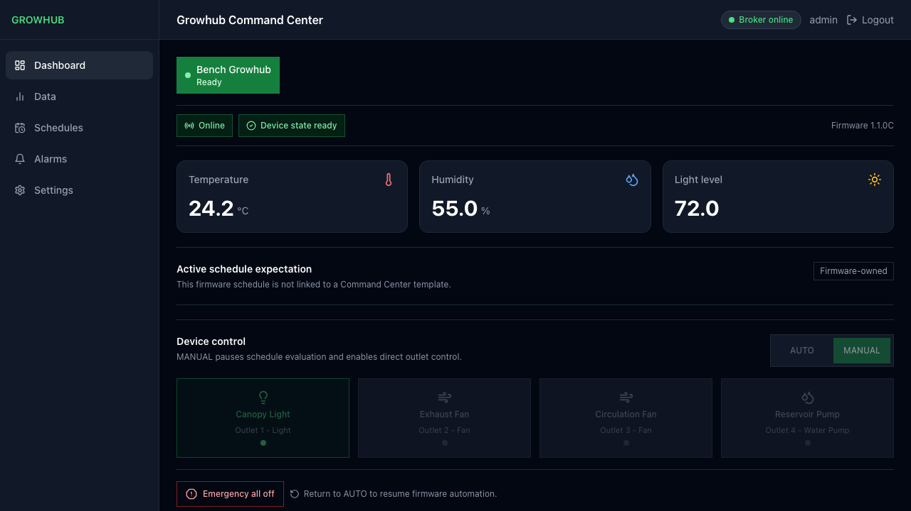

# Growhub Command Center

Local control, scheduling, and monitoring for Growhub devices running CE
firmware.



Growhub Command Center is a self-hosted web application for operating one or
more Growhub CE devices on a local network. It packages the web UI, API, SQLite
storage, and an MQTT broker into one Docker Compose deployment. Devices keep
running their schedules when Command Center is offline because CE firmware is
authoritative for active device state and schedule execution.

## Capabilities

- Discover CE devices and rebuild their state from retained MQTT messages
- View current sensors, outlet state, warnings, and recent activity
- Edit firmware-owned outlet assignments and user-facing labels
- Create named, revisioned schedule templates such as Seedling, Veg, and Flower
- Map assignment-based template roles onto different physical outlet layouts
- Preflight schedule loads and surface missing, ambiguous, or extra assignments
- Detect firmware-local schedule and label drift without overwriting it
- Switch between AUTO and MANUAL, control individual outlets, and turn all off
- Synchronize invalid device wall time and run mapped water pumps on demand
- Export redacted diagnostics and perform backup, restore, update, and reset
- Configure the first local administrator entirely in the browser

The browser never connects to MQTT directly. It uses a closed, authenticated
HTTP API; the server validates CE topics and payloads, publishes typed actions,
and waits for newer authoritative firmware state before reporting success.

## Deployment

The supported deployment is Docker Compose on Windows, macOS, or Linux,
including Raspberry Pi. Images target Linux AMD64 and ARM64; a Raspberry Pi is
supported but not required.

Requirements:

- Git
- Node.js 24 LTS with npm 11 or newer
- Docker Desktop, or Docker Engine with the Compose plugin

Start Command Center:

```sh
git clone https://github.com/Shrug-Lord/growhub-command-center.git
cd growhub-command-center
npm run compose:up
```

For prerequisite installation, host addressing, first-run administrator setup,
CE device connection, verification, and troubleshooting, follow the complete
[installation guide](docs/INSTALL.md).

Open [http://localhost](http://localhost) on the Docker host. Use
`http://growhub.local` when the host is named `growhub` and your network resolves
local hostnames; otherwise use the host's LAN IP address. The UI/API uses port
80 and CE firmware connects to the bundled MQTT broker on port 1883 by default.

The first visit opens administrator setup. Create the credential in the UI,
sign in, configure each CE device to use this host as its MQTT broker, and review
the firmware-published outlet setup when the device appears. No default
credential or configuration-file credential is shipped.

Check service state:

```sh
docker compose -f deploy/compose.yml ps
curl http://localhost/health/ready
```

Stop the services without deleting application data:

```sh
npm run compose:down
```

See [Operations](docs/OPERATIONS.md) for port overrides, updates, backups,
restores, credential recovery, remote access, and external-broker ownership.

## Security Boundary

Command Center is intended for a trusted local network. The default deployment
uses plain HTTP and exposes anonymous MQTT because CE 1.1.0C does not support
broker credentials. Do not forward ports 80 or 1883 directly from an internet
router. Use a VPN for remote access, or configure an HTTPS reverse proxy and an
explicit trusted-proxy allowlist.

Authentication uses an HTTP-only server-side session, in-memory browser CSRF
tokens, Argon2id password verification, and rate limits. Diagnostics exports
exclude credentials, sessions, CSRF values, raw authentication data, and MQTT
publication controls. Report vulnerabilities through the process in
[SECURITY.md](SECURITY.md).

## Release Status

This public repository is at release-candidate stage, not yet a supported
release. Automated unit, integration, browser, accessibility, security,
container, Linux x64, macOS ARM64, Windows x64, and multi-architecture image
checks pass in public CI. The CE 1.1.0C hardware contract passed on three
physical Growhub controllers. Clean install, update, reboot, backup, destructive
restore, and device-reconnect rehearsals also passed on the reference Raspberry
Pi ARM64 host, with an isolated clean-install and restore repeat on macOS ARM64.

The first public tag remains deliberately blocked until the focused manual
keyboard and screen-reader release-host spot check passes. Public CI, the
AMD64/ARM64 image preflight, and private vulnerability reporting are complete.

Current acceptance criteria and evidence links are in the
[CE ship plan](docs/SHIP-PLAN.md) and [release process](docs/RELEASE.md).

## Development

Install locked dependencies and run the main local checks:

```sh
npm run setup
npm run verify
npm run test:e2e
npm run security:signatures
```

The project keeps the existing React/Vite frontend and Node/Express server,
with SQLite persistence and server-owned MQTT.js integration. See
[Development](docs/DEVELOPMENT.md) for native and Docker workflows.

## Documentation

- [Installation](docs/INSTALL.md)
- [Architecture](docs/ARCHITECTURE.md)
- [CE ship plan and acceptance criteria](docs/SHIP-PLAN.md)
- [Operations](docs/OPERATIONS.md)
- [Development](docs/DEVELOPMENT.md)
- [Release process](docs/RELEASE.md)
- [Contributing](CONTRIBUTING.md)
- [Security policy](SECURITY.md)
- [Changelog](CHANGELOG.md)

Architecture decisions are recorded under [docs/adr](docs/adr).

## License

Growhub Command Center is available under the [MIT License](LICENSE).
